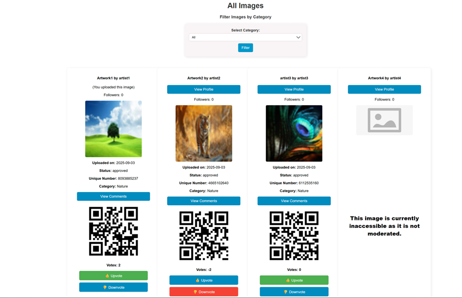
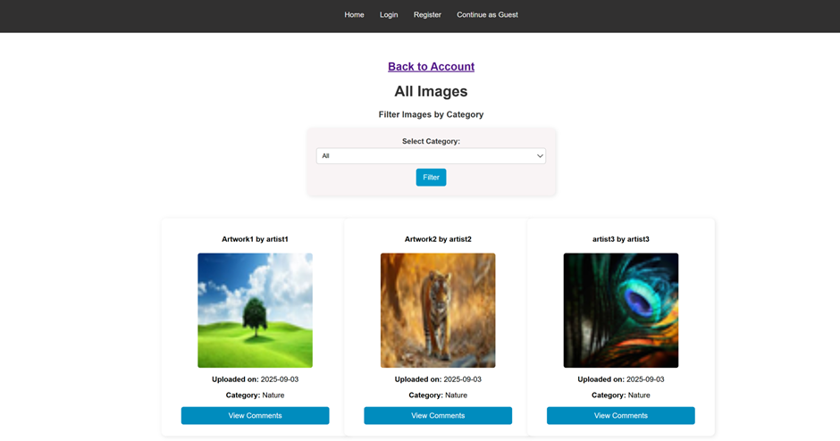
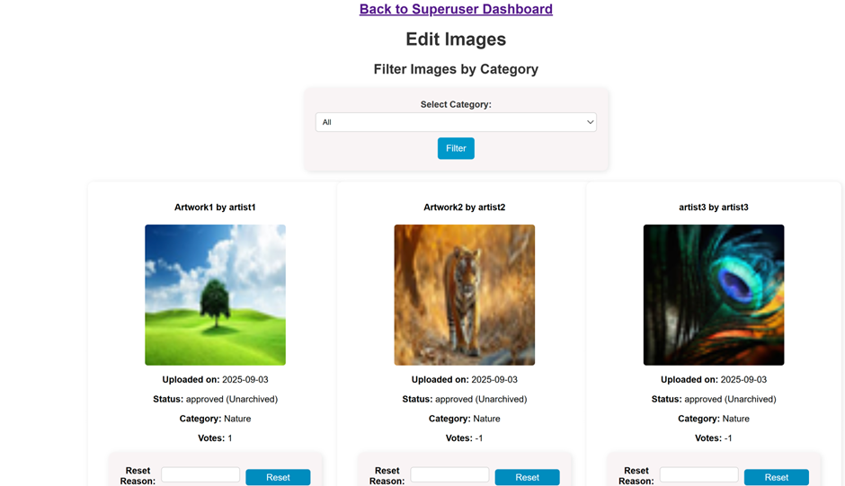

# ImageShareWeb

A web-based image sharing platform built with Flask, allowing users to upload, share, vote, and comment on images. Includes authentication, email verification, and moderation tools by a superuser.

## Features
- User registration, login, and profile management
- Email verification and password reset via email
- Upload and share images (with server-side validation and re-encoding)
- Upvote/downvote system (AJAX-based)
- Commenting on images
- Follow/unfollow users
- QR code generation for approved images
- Admin role for moderating content
- Responsive UI with Flask templates, CSS, and JavaScript

## Tech Stack
- **Backend:** Python, Flask, SQLAlchemy, Flask-Login, Flask-WTF
- **Frontend:** HTML, CSS, JavaScript
- **Database:** SQLite (default) — easily swappable for PostgreSQL/MySQL
- **Other:** Pillow (image handling), qrcode (QR generation), WTForms

## Installation

1. Clone the repository:
   ```bash
   git clone https://github.com/BenjaminJose06/ImageShareWeb.git
   cd ImageShareWeb
   ```

2. Create a virtual environment and install dependencies:
   ```bash
   python -m venv .venv
   source .venv/bin/activate   # On Windows: .venv\Scripts\activate
   pip install -r requirements.txt
   ```

3. Configure environment variables:  
   Copy `.env.example` to `.env` and fill in your Gmail details:  

   ```ini
   GMAIL_USER=your_email@gmail.com
   GMAIL_APP_PASSWORD=your_app_password

4. Run the app:
   ```bash
   flask run
   ```

## Project Structure
```
ImageShareWeb/
│── static/        # CSS, JS, and images
│── templates/     # HTML templates
│── app.py         # App factory & entry point
│── routes.py      # Routes (blueprint)
│── models.py      # Database models
│── forms.py       # Forms (WTForms)
│── requirements.txt
│── README.md
│── .env (not committed)
```

## Screenshots

**User image view:**  


**Guest view:**  


**Superuser dashboard:**  


## License
This project is licensed under the MIT License.
